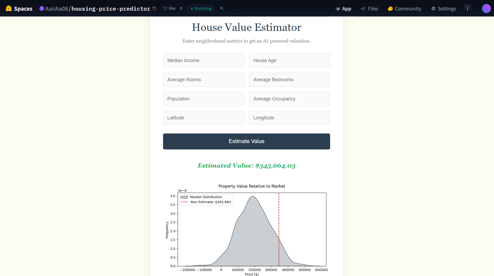
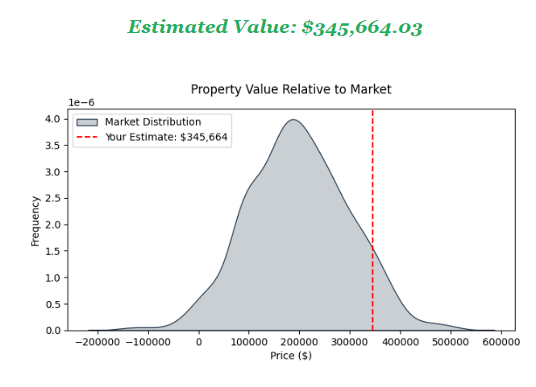

# 🏠 California Housing: MLOps Pipeline

This repository contains an end-to-end Machine Learning project that predicts California property values. Model trained in VSCode and then moved to a containerized Flask application deployed on Hugging Face Spaces.

[Live Demo](https://aaisha08-housing-price-predictor.hf.space) You can check it out

## 🛠️ Tech Stack
- **Languages:** Python 3.11
- **ML Framework:** XGBoost, Scikit-learn
- **API/Web:** Flask, Gunicorn, Jinja2
- **Data Viz:** Matplotlib, Seaborn
- **DevOps:** Docker, GitHub Actions (optional)
- **Deployment:** Hugging Face Spaces

## 🖼️ The Application

### **1. Minimalist Valuation Interface**
The UI allows users to input neighborhood metrics (Median Income, House Age, geographic coordinates, etc.) to trigger real-time inference.
>  

### **2. Dynamic Market Analytics**
The app doesn't just return a number; it generates a live **Seaborn density plot** to provide context, showing where the prediction sits relative to the broader California housing market.
> 

## 🧠 Engineering Highlights

### 1. Production-Grade Feature Engineering
Unlike standard baseline models, this project utilizes custom transformers to engineer high-signal features:
- **Location Wealth Index:** Euclidean distance to major economic hubs (SF/LA) weighted by Median Income.
- **Occupancy Dynamics:** Normalizing `AveRooms` and `AveBedrms` by `AveOccup` to identify high-density living areas.

### 2. MLOps Rigor
- **Persistence:** Models and feature lists are serialized separately to ensure consistency during inference.
- **Containerization:** The application is fully Dockerized to eliminate "environment drift."
- **Inference Visualization:** The API doesn't just return a number; it dynamically generates a distribution plot using `io.BytesIO` to show the prediction's context within the market.

## 📁 Repository Structure
├── app.py              # Main Flask Application

├── model_features.pkl  # Metadata for feature alignment

├── housing_model.pkl   # Serialized XGBoost model

├── static/             # CSS 

├── templates/          # HTML Templates

├── Dockerfile          # Container configuration

└── requirements.txt    # Production dependencies
